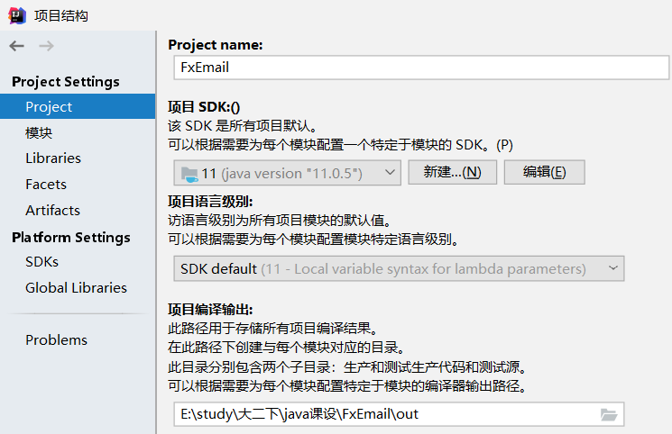
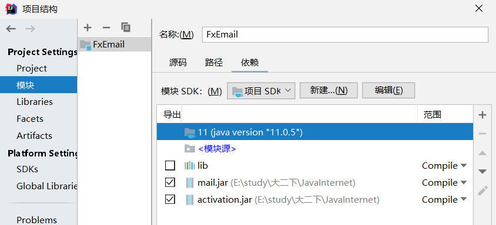
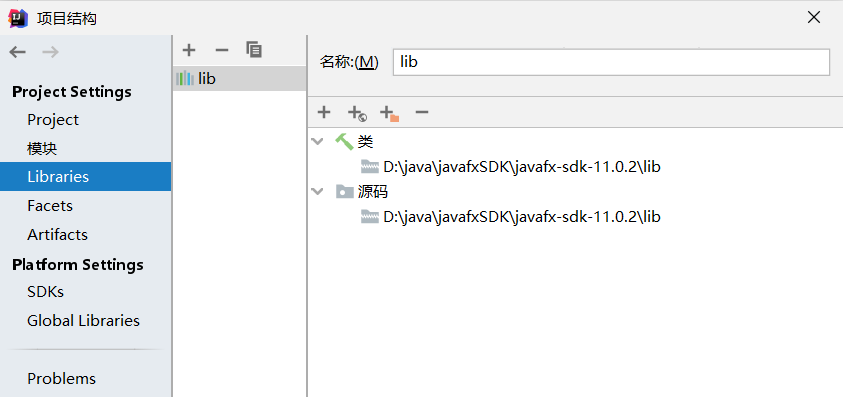
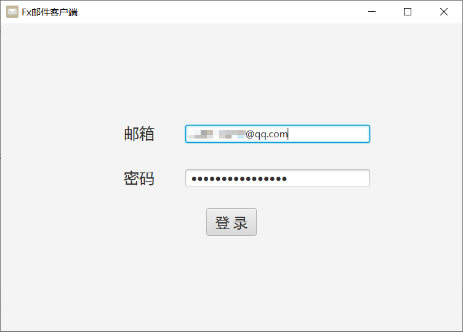
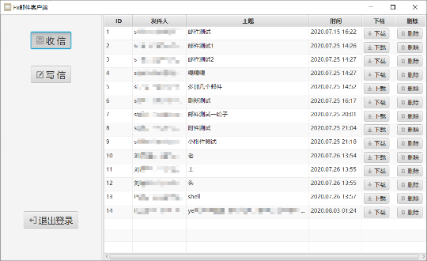
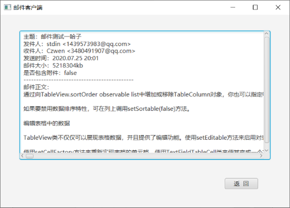
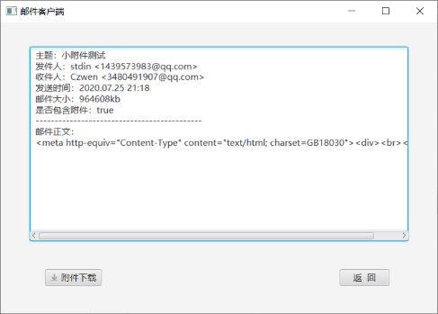
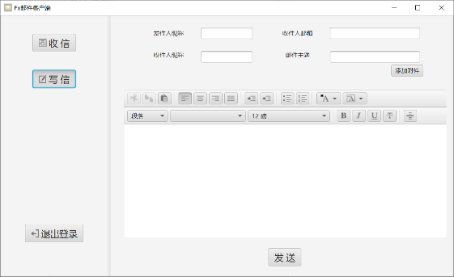

# FxMail邮件客户端

中南大学Java+网络课设

## 开发环境与配置

开发环境：IDEA 2019.3.2、JavaFX Scene Builder 2.0

配置：java11.0.5、mail.jar、activation.jar、javafx-sdk-11.0.2

项目采用MVC框架搭建，使用JavaFX Scene Builder设计界面，可采用CSS进行界面美化，由于检查时间突然提前，尚未进行美化，后期有时间的话可能会试一下补锅:broken_heart:

## 使用方法

关于该程序的配置环境部分，由于当时的javafx版本只适配到java11，使用其他java版本大概会出现各种奇奇怪怪的报错:see_no_evil:

运行前需自行配置好JavaFx环境并导入mail.jar和activation.jar:lollipop:

IDEA下部分配置截图：

## 程序运行界面

- 登陆界面

  

- 收信面板

  

- 邮件内容

  

- 写信面板

  